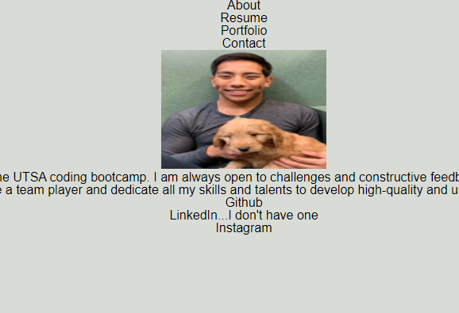

# Martins-React-Portfolio

## Description

Being a web developer means being part of a community. You’ll need a place to share your projects not only if you're applying for jobs or working as a freelancer but also so that you can share your work with fellow developers and collaborate on future projects.

## Table of Contents 
- [Description](#description)
- [Usage](#usage)
- [Questions](#questions)

## Usage
     
<a href="https://mardyyy.github.io/Martins-React-Portfolio/"> Link to deployed application</a>

## Questions

For any additional questions, reach me at <a href="martinapopot@gmail.com">My email</a> or <a href="https://github.com/mardyyy">My github</a>.

